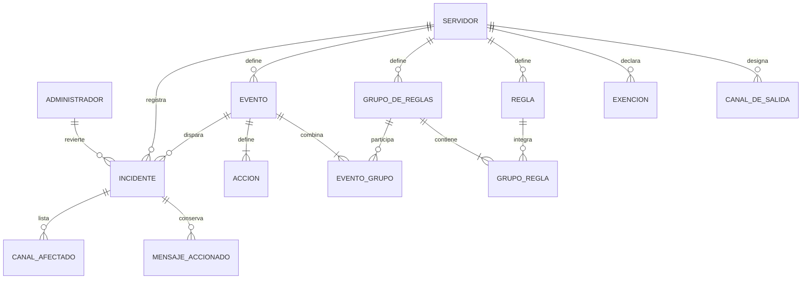

# Modelo conceptual de datos

**Proyecto:** discord-bots-admin
**Documento:** modelo-conceptual_v1.0.md
**Versión:** 1.0
**Estado:** Propuesto
**Fecha:** 2026-06-20
**Autor:** Analista Funcional senior (AG-02)

Este documento levanta el modelo conceptual del dominio de moderación: las entidades, sus atributos con semántica (sin tipos físicos, que viven en 05), sus relaciones, sus cardinalidades y las reglas conceptuales que lo restringen. El estado de conducta (ventanas deslizantes de actividad por usuario) y el estado de antirrebote viven en memoria y no se persisten; se nombran como nota al final, no como entidades del modelo.

## 1. Entidades

### 1.1 Administrador

Cuenta única que opera el sistema. Es el único actor autorizado a configurar la moderación, revisar incidentes y revertir baneos.

Ejemplo de instancia: la cuenta del operador del servicio, creada en el primer ingreso.

### 1.2 Servidor

Servidor de la plataforma a moderar, registrado como un contexto independiente del firewall multi-contexto, con su propia credencial y su propio estado de conexión.

Ejemplo de instancia: el servidor de la comunidad principal, con su snowflake, su token cifrado y estado activo.

### 1.3 CanalDeSalida

Canal designado con un nombre lógico al que el sistema envía sus reportes, por ejemplo el registro de moderación. Un servidor puede tener varios, con propósito lógico distinto.

Ejemplo de instancia: el canal "mod-log" del servidor principal, con propósito de reporte de incidentes.

### 1.4 Exención

Sujeto de confianza —rol, usuario o canal— excluido de la moderación, que se descarta antes de evaluar cualquier regla.

Ejemplo de instancia: una exención de tipo rol que cubre al staff del servidor principal.

### 1.5 Regla

Predicado configurable que decide si un mensaje o la actividad de un usuario corresponde a moderación. Se distinguen dos clases: regla de contenido (predicado sin estado sobre un mensaje aislado, por expresión regular o palabras clave) y regla de conducta (predicado con estado sobre la actividad reciente del usuario, por frecuencia o canales distintos).

Ejemplo de instancia: una regla de conducta de ráfaga distribuida con umbral de 3 canales distintos y ventana de 2 s.

### 1.6 GrupoDeReglas

Conjunto de reglas evaluado con un modo de coincidencia: todas, alguna, o al menos N. Es la unidad de combinación booleana del primer nivel de anidamiento.

Ejemplo de instancia: un grupo "spam distribuido" con modo alguna, que agrupa la regla de ráfaga y una regla de contenido por enlaces.

### 1.7 GrupoRegla

Asociación entre un grupo de reglas y una regla que lo integra. Materializa la pertenencia de muchas reglas a muchos grupos.

Ejemplo de instancia: la pertenencia de la regla de ráfaga al grupo "spam distribuido".

### 1.8 Evento

Política de moderación: conjunto de grupos de reglas que, al cumplirse, dispara un conjunto de acciones. Tiene una prioridad de evaluación, una bandera continuar y un modo (simulación o ejecución real).

Ejemplo de instancia: la política "corte de ráfaga" con prioridad 1, bandera continuar desactivada y modo simulación.

### 1.9 EventoGrupo

Asociación entre un evento y un grupo de reglas que lo compone. Materializa la combinación de muchos grupos en muchos eventos, segundo y último nivel de anidamiento.

Ejemplo de instancia: la inclusión del grupo "spam distribuido" en la política "corte de ráfaga".

### 1.10 Acción

Operación de moderación que ejecuta un evento al cumplirse, con un orden de ejecución dentro del evento y sus parámetros. Tipos: reportar, banear, banear con borrado retroactivo, desbanear, timeout, expulsar, asignar o quitar rol.

Ejemplo de instancia: una acción de banear con borrado retroactivo de 1 día, segunda en el orden de su evento.

### 1.11 Incidente

Registro de un disparo de evento: su fecha, el emisor, el evento que disparó, el modo (real o simulación), el resultado de la acción y su eventual reversión. Conserva la evidencia para revisión.

Ejemplo de instancia: un incidente del 2026-06-20 por la política "corte de ráfaga", en modo real, con baneo ejecutado y sin reversión.

### 1.12 MensajeAccionado

Copia de un mensaje que disparó o quedó involucrado en un incidente, conservada antes de cualquier remoción para la revisión posterior.

Ejemplo de instancia: la copia de la imagen promocional publicada por el emisor en el canal de anuncios.

### 1.13 CanalAfectado

Canal en el que el incidente tuvo efecto, por contener mensajes accionados o por haber sido alcanzado por la limpieza retroactiva.

Ejemplo de instancia: el canal de anuncios listado como afectado por el incidente de ráfaga.

## 2. Atributos clave

| Entidad | Atributo | Semántica | Restricción conceptual |
| --- | --- | --- | --- |
| Administrador | identificador de cuenta | Nombre con el que el administrador inicia sesión | Único en el sistema (RC-06) |
| Administrador | resguardo de contraseña | Verificador de la contraseña, nunca en texto claro | Obligatorio; no reversible (RC-06) |
| Servidor | snowflake del servidor | Identificador de la plataforma del servidor | Único; tratado como texto (RC-02) |
| Servidor | token cifrado | Credencial de bot del servidor, cifrada en reposo | Obligatorio; nunca en texto claro (RC-07) |
| Servidor | estado de conexión | Conectado o desconectado del canal de eventos | Derivado de la operación del bot |
| Servidor | estado de activación | Registrado inactivo o activo tras la prueba | Activo solo con prueba superada (RC-08) |
| CanalDeSalida | snowflake del canal | Identificador del canal de la plataforma | Tratado como texto (RC-02) |
| CanalDeSalida | propósito lógico | Rol del canal, por ejemplo reporte de incidentes | Pertenece a un servidor (RC-01) |
| Exención | tipo de sujeto | Rol, usuario o canal | Valor de un conjunto cerrado |
| Exención | snowflake del sujeto | Identificador del rol, usuario o canal exento | Tratado como texto (RC-02) |
| Regla | clase | Contenido o conducta | Valor de un conjunto cerrado |
| Regla | criterio | Expresión regular, palabras clave, umbral o ventana según la clase | Válido según la clase (RC-09) |
| GrupoDeReglas | modo de coincidencia | Todas, alguna, o al menos N | Definido; al menos una regla asociada (RC-04) |
| GrupoRegla | grupo y regla referenciados | Pareja que vincula un grupo con una regla | Ambos extremos deben existir (RC-03) |
| Evento | prioridad | Orden de evaluación frente a otros eventos | Define el orden determinista (RC-05) |
| Evento | bandera continuar | Permite seguir evaluando tras coincidir | Booleano |
| Evento | modo | Simulación o ejecución real | Simulación por defecto (RC-10) |
| EventoGrupo | evento y grupo referenciados | Pareja que vincula un evento con un grupo | Ambos extremos deben existir (RC-03) |
| Acción | tipo | Reportar, banear, banear con borrado, desbanear, timeout, expulsar, rol | Valor de un conjunto cerrado |
| Acción | orden de ejecución | Posición de la acción dentro del evento | Determina la secuencia (RC-05) |
| Acción | ventana de borrado | Días hacia atrás a limpiar, cuando aplica | Entre 0 y 7 días (RC-11) |
| Incidente | fecha | Momento del disparo del evento | Obligatorio |
| Incidente | emisor | Snowflake del usuario accionado | Tratado como texto (RC-02) |
| Incidente | modo | Real o simulación | Coherente con el evento disparado (RC-10) |
| Incidente | resultado | Acción ejecutada, simulada, no accionable o fallida | Valor de un conjunto cerrado |
| Incidente | reversión | Datos del desbaneo si lo hubo: autor y fecha | Solo si el resultado fue baneo real |
| MensajeAccionado | contenido copiado | Texto y referencias del mensaje conservado | Pertenece a un incidente (RC-01) |
| MensajeAccionado | snowflake del mensaje | Identificador del mensaje en la plataforma | Tratado como texto (RC-02) |
| CanalAfectado | snowflake del canal | Identificador del canal alcanzado por el incidente | Pertenece a un incidente (RC-01) |

## 3. Relaciones

- Un Administrador opera el sistema; no posee directamente entidades, pero es el único autorizado a configurarlas y registra la reversión de un incidente.
- Un Servidor designa CanalesDeSalida, declara Exenciones, contiene Reglas, GruposDeReglas y Eventos, y registra Incidentes.
- Un GrupoDeReglas agrupa Reglas a través de GrupoRegla.
- Un Evento compone GruposDeReglas a través de EventoGrupo y define Acciones.
- Un Incidente es disparado por un Evento, conserva MensajesAccionados y lista CanalesAfectados.

## 4. Cardinalidades

- Administrador (1) —— (0..N) Incidente revertido. Un administrador revierte cero o muchos incidentes; un incidente es revertido por a lo sumo un administrador.
- Servidor (1) —— (0..N) CanalDeSalida. Un servidor tiene cero o muchos canales de salida; un canal de salida pertenece a un servidor.
- Servidor (1) —— (0..N) Exención. Un servidor declara cero o muchas exenciones; una exención pertenece a un servidor.
- Servidor (1) —— (0..N) Regla. Un servidor define cero o muchas reglas; una regla pertenece a un servidor.
- Servidor (1) —— (0..N) GrupoDeReglas. Un servidor define cero o muchos grupos; un grupo pertenece a un servidor.
- Servidor (1) —— (0..N) Evento. Un servidor define cero o muchos eventos; un evento pertenece a un servidor.
- Servidor (1) —— (0..N) Incidente. Un servidor registra cero o muchos incidentes; un incidente pertenece a un servidor.
- GrupoDeReglas (1) —— (1..N) GrupoRegla —— (1) Regla. Un grupo tiene una o muchas reglas; una regla puede integrar muchos grupos.
- Evento (1) —— (1..N) EventoGrupo —— (1) GrupoDeReglas. Un evento combina uno o muchos grupos; un grupo puede integrar muchos eventos.
- Evento (1) —— (1..N) Acción. Un evento tiene una o muchas acciones; una acción pertenece a un evento.
- Evento (1) —— (0..N) Incidente. Un evento dispara cero o muchos incidentes; un incidente es disparado por un evento.
- Incidente (1) —— (0..N) MensajeAccionado. Un incidente conserva cero o muchos mensajes copiados; un mensaje copiado pertenece a un incidente.
- Incidente (1) —— (0..N) CanalAfectado. Un incidente lista cero o muchos canales afectados; un canal afectado pertenece a un incidente.

## 5. Reglas conceptuales

El modelo invoca las siguientes reglas conceptuales, definidas en `reglas-conceptuales-de-modelo/`:

- RC-01: Integridad referencial de las entidades dependientes de Servidor e Incidente.
- RC-02: Identidad de los snowflakes almacenados como texto.
- RC-03: Integridad de las asociaciones GrupoRegla y EventoGrupo.
- RC-04: Composición mínima y modo de coincidencia de un GrupoDeReglas.
- RC-05: Orden determinista de Eventos por prioridad y de Acciones por orden de ejecución.
- RC-06: Unicidad y resguardo de la cuenta Administrador.
- RC-07: Confidencialidad del token del Servidor.
- RC-08: Activación de un Servidor condicionada a la prueba de configuración.
- RC-09: Validez del criterio de una Regla según su clase.
- RC-10: Coherencia del modo entre Evento e Incidente.
- RC-11: Tope de la ventana de borrado de una Acción.

## 6. Glosario

Los términos del dominio (ráfaga distribuida, evento o política, regla de contenido, regla de conducta, exención, modo simulación, borrado retroactivo, desbaneo, incidente, canal de salida, token de bot, snowflake) están definidos en `00_contexto/vision-producto_v1.0.md` §9 y en el glosario del intake §12, y se reutilizan en toda la categoría 02 sin redefinirse aquí.

## 7. Diagrama

## 8. Trazabilidad

| Entidad | CU que la consumen | RN que la restringen |
| --- | --- | --- |
| Administrador | CU-06, CU-07, CU-08, CU-09 | RN-12, RN-13 |
| Servidor | CU-01, CU-10, CU-12, CU-13 | RN-08, RN-14, RN-16 |
| CanalDeSalida | CU-05, CU-10 | RN-08, RN-11 |
| Exención | CU-01, CU-04, CU-15 | RN-07, RN-08 |
| Regla | CU-01, CU-04, CU-11 | RN-03, RN-10, RN-15 |
| GrupoDeReglas | CU-11 | RN-15 |
| GrupoRegla | CU-11 | RN-15 |
| Evento | CU-02, CU-04, CU-11, CU-14 | RN-04, RN-05, RN-09 |
| EventoGrupo | CU-11 | RN-15 |
| Acción | CU-02, CU-03, CU-04, CU-11, CU-16 | RN-02, RN-05, RN-06 |
| Incidente | CU-02, CU-05, CU-06, CU-07, CU-14 | RN-09, RN-11 |
| MensajeAccionado | CU-05, CU-06 | RN-11 |
| CanalAfectado | CU-03, CU-05, CU-06 | RN-11 |

## 9. Control de cambios

| Versión | Fecha | Cambios |
| --- | --- | --- |
| 1.0 | 2026-06-20 | Versión inicial del modelo conceptual con 13 entidades, derivada de §17 P.4 del intake |

## Nota sobre estado en memoria (no persistido)

El estado de conducta —ventanas deslizantes de actividad reciente por usuario que alimentan las reglas de conducta— y el estado de antirrebote por usuario viven en memoria y se pierden ante un reinicio del servicio, según el trade-off aceptado en el alcance. No son entidades del modelo conceptual persistido y por eso no figuran en el diagrama ni en las cardinalidades; se documentan aquí para evitar que se confundan con entidades de la base.
