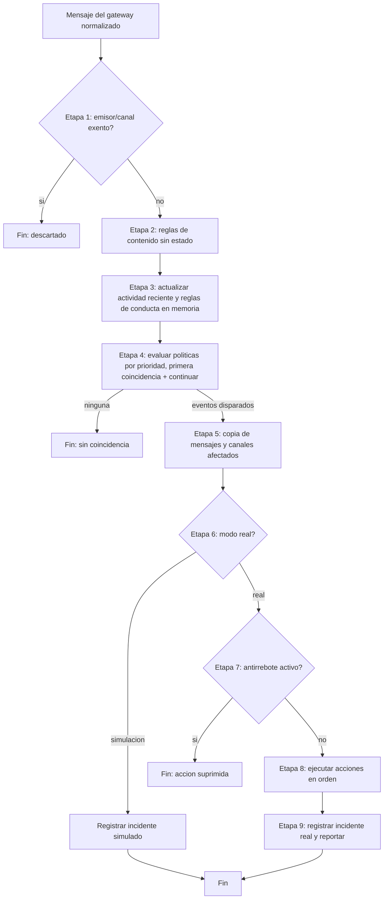

# Flujo de ejecución — pipeline de evaluación de moderación

**Proyecto:** discord-bots-admin
**Documento:** flujo-ejecucion_v1.0.md
**Versión:** 1.0
**Estado:** Propuesto
**Fecha:** 2026-06-20
**Autor:** Arquitecto de Software Senior (AG-05)

Este documento describe el pipeline de evaluación de un mensaje entrante, núcleo del dominio de moderación (ADR-01, ADR-04). Cada etapa transforma los datos y se apoya en componentes de la vista lógica de `arquitectura-solucion_v1.0.md §3`. El pipeline corresponde al flujo de moderación de `SOLUTION-INTAKE §6` y a las reglas RN-04, RN-05, RN-06, RN-07, RN-09, RN-11.

## 1. Entrada del pipeline

Disparador: el Adaptador del gateway recibe un mensaje del canal de eventos en tiempo real de la plataforma, en el contexto de un servidor activo (firewall multi-contexto, ADR-13). El adaptador normaliza el evento en un Mensaje de dominio.

Mensaje (datos): snowflake del servidor (contexto), snowflake del emisor, snowflake del canal, snowflake del mensaje, contenido textual y referencias de adjuntos, marca de tiempo. Snowflakes como texto (RN-08).

## 2. Etapas del pipeline

### Etapa 1 — Descarte de usuarios exentos

- Componente: filtro de exentos (en el pipeline) sobre las exenciones del contexto.
- Transformación: si el emisor, su rol o el canal coinciden con una exención del servidor, el pipeline termina sin evaluar reglas. Entrada: Mensaje. Salida: continuar o descartar.
- Regla: descarte previo de los sujetos exentos (RN-07). Garantiza que ningún exento llega a la evaluación.
- CU: CU-15 (consumo de exenciones), parte de CU-01/CU-02/CU-04.

### Etapa 2 — Evaluación de reglas de contenido (sin estado)

- Componente: Evaluador de reglas de contenido.
- Transformación: evalúa el contenido del Mensaje contra las reglas de contenido del contexto (expresión regular o palabras clave), con validación previa del patrón y tope de tiempo (RN-03, ADR-08). Entrada: Mensaje. Salida: conjunto de reglas de contenido coincidentes.
- CU: CU-04.

### Etapa 3 — Actualización de actividad reciente del usuario (con estado, en memoria)

- Componente: Estado de conducta en memoria; Evaluador de reglas de conducta.
- Transformación: registra el evento de actividad (emisor, canal, marca de tiempo) en la ventana deslizante del contexto y recalcula las métricas de conducta (canales distintos en la ventana, frecuencia). Entrada: Mensaje + estado previo. Salida: métricas de ventana + conjunto de reglas de conducta coincidentes. El estado vive en memoria y no se persiste (ADR-09).
- CU: CU-01.

### Etapa 4 — Evaluación de políticas por prioridad (primera coincidencia + continuar)

- Componente: Evaluador de políticas.
- Transformación: combina las coincidencias de reglas según el modo de cada GrupoDeReglas (todas, alguna, al menos N) y de cada Evento (combinación de grupos). Evalúa los eventos del contexto por prioridad y se detiene en la primera coincidencia, salvo que la bandera continuar esté activa, en cuyo caso sigue evaluando eventos siguientes (RN-04). Entrada: coincidencias de etapas 2 y 3. Salida: lista ordenada de Eventos disparados.
- CU: CU-01, CU-02, CU-04, CU-11 (configuración), CU-14 (modo).

### Etapa 5 — Toma de copia de mensajes (evidencia)

- Componente: Servicio de incidentes.
- Transformación: por cada Evento disparado, toma una copia de los mensajes involucrados y la lista de canales afectados antes de cualquier remoción (RN-11, RN-05). Entrada: Evento disparado + Mensaje(s). Salida: evidencia (MensajeAccionado, CanalAfectado) lista para persistir.
- CU: CU-05, CU-06.

### Etapa 6 — Decisión de modo: ejecución real o simulación

- Componente: Motor de moderación.
- Transformación: si el modo del Evento es simulación, se omite la ejecución de acciones y se registra lo que se habría hecho (RN-09, RC-10). Si es real, se procede a la etapa 7. El modo simulación es el valor por defecto de un evento nuevo (RC-10).
- CU: CU-14.

### Etapa 7 — Antirrebote por usuario

- Componente: Antirrebote por usuario (en memoria).
- Transformación: si ya se accionó sobre el mismo usuario dentro de la ventana de antirrebote del contexto, se suprime la acción repetida y no se genera un nuevo incidente; si no, se registra la marca y se continúa (RN-06, ADR-09). Entrada: Evento disparado en modo real + estado de antirrebote. Salida: ejecutar o suprimir.
- CU: CU-16.

### Etapa 8 — Ejecución de acciones en orden

- Componente: Ejecutor de acciones, Adaptador del gateway/API.
- Transformación: ejecuta las acciones del Evento en orden de ejecución (RN-05): reportar al canal privado, banear, banear con borrado retroactivo (ventana 0..7 días, RC-11, RN-02), desbanear, timeout, expulsar, asignar o quitar rol. Si una acción no es posible por jerarquía de roles o permisos faltantes, se clasifica como no accionable y no se aborta el pipeline (RN-01, ADR-08). Entrada: Evento + evidencia. Salida: resultado por acción (ejecutada, no accionable, fallida).
- CU: CU-02, CU-03, CU-04, CU-05, CU-07 (desbaneo se ejecuta desde el panel, no en este pipeline).

### Etapa 9 — Registro del incidente

- Componente: Servicio de incidentes, Persistencia.
- Transformación: persiste el Incidente con su fecha, emisor, evento, modo (real o simulación), resultado y la evidencia (MensajeAccionado, CanalAfectado), en una unidad confirmada (RN-11). Entrada: resultado de las etapas 5 a 8. Salida: Incidente persistido y, si corresponde, reporte enviado al canal privado.
- CU: CU-05, CU-06; auditoría del servicio al journal (`arquitectura-solucion §7`).

## 3. Diagrama del pipeline

## 4. Concurrencia y estado

- El pipeline corre en la cara de moderación (bot) por cada mensaje entrante de cada contexto; el panel opera concurrentemente sobre la misma persistencia en modo WAL (ADR-02).
- El estado de conducta (etapa 3) y el antirrebote (etapa 7) viven en memoria, particionados por contexto; se pierden ante un reinicio (ADR-09).
- La copia de mensajes (etapa 5) se toma antes de cualquier borrado (etapa 8) para preservar la evidencia (RN-11, RN-05).
- Si el gateway cae a mitad de una ráfaga, los mensajes no recibidos no se evalúan; el borrado retroactivo del baneo limpia lo previo dentro de la ventana (CU-13, `SOLUTION-INTAKE §7`).

## 5. Trazabilidad

| Etapa | CU | RN | ADR | Componente |
| --- | --- | --- | --- | --- |
| 1 Descarte de exentos | CU-15, CU-01 | RN-07 | ADR-08 | Filtro de exentos |
| 2 Reglas de contenido | CU-04 | RN-03 | ADR-04, ADR-08 | Evaluador de contenido |
| 3 Actividad reciente / conducta | CU-01 | RN-10 | ADR-09 | Estado de conducta, Evaluador de conducta |
| 4 Políticas por prioridad | CU-01, CU-02, CU-04, CU-11 | RN-04 | ADR-12 | Evaluador de políticas |
| 5 Copia de mensajes | CU-05, CU-06 | RN-11, RN-05 | ADR-02 | Servicio de incidentes |
| 6 Modo simulación/real | CU-14 | RN-09 | ADR-09 | Motor de moderación |
| 7 Antirrebote | CU-16 | RN-06 | ADR-09 | Antirrebote por usuario |
| 8 Ejecución de acciones | CU-02, CU-03, CU-04, CU-05 | RN-01, RN-02, RN-05 | ADR-08, ADR-13 | Ejecutor de acciones, Adaptador del gateway |
| 9 Registro del incidente | CU-05, CU-06 | RN-11 | ADR-02 | Servicio de incidentes, Persistencia |

## 6. Control de cambios

| Versión | Fecha | Descripción |
| --- | --- | --- |
| 1.0 | 2026-06-20 | Pipeline inicial de 9 etapas con transformaciones de datos, diagrama y trazabilidad a CU/RN/ADR, derivado del flujo de moderación de `SOLUTION-INTAKE §6`. |
